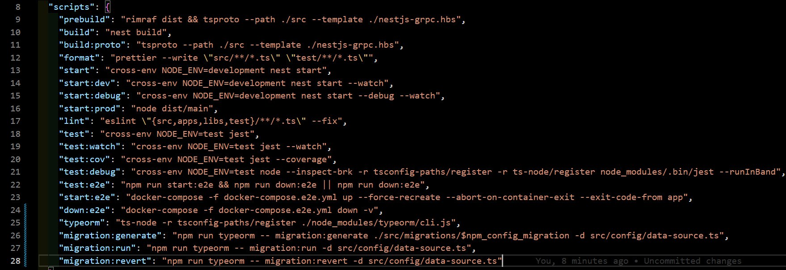
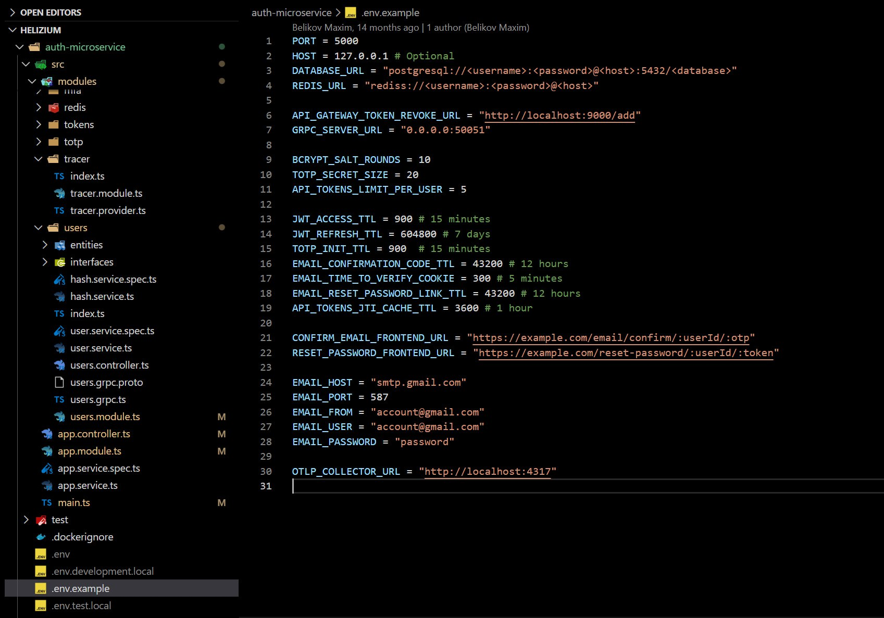
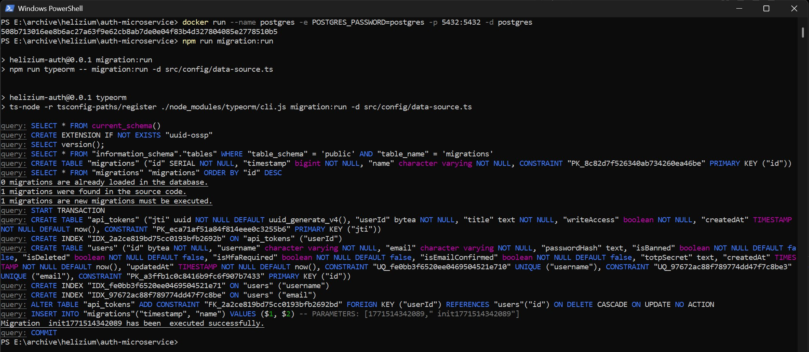
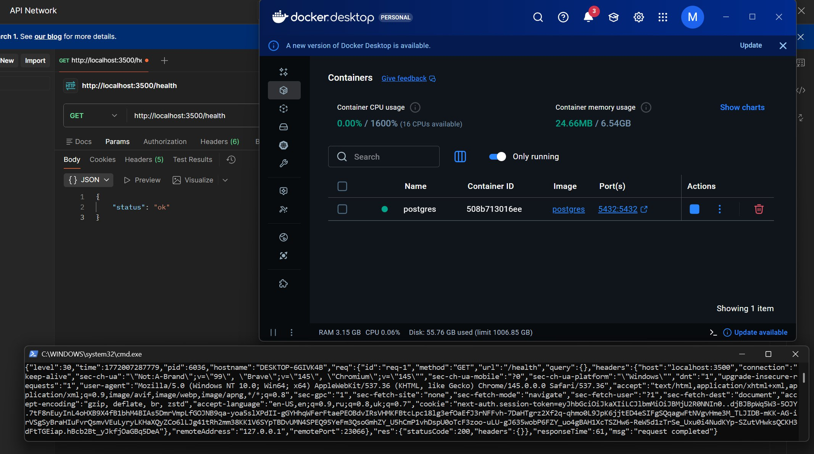
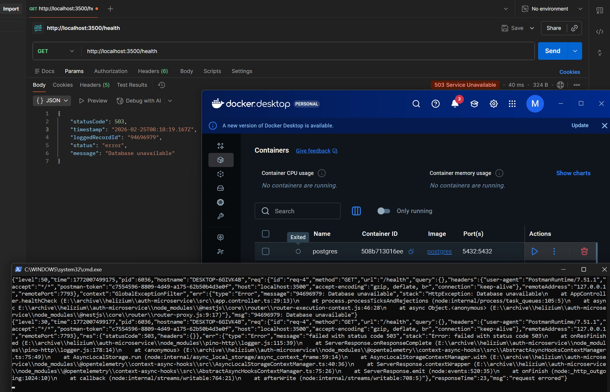
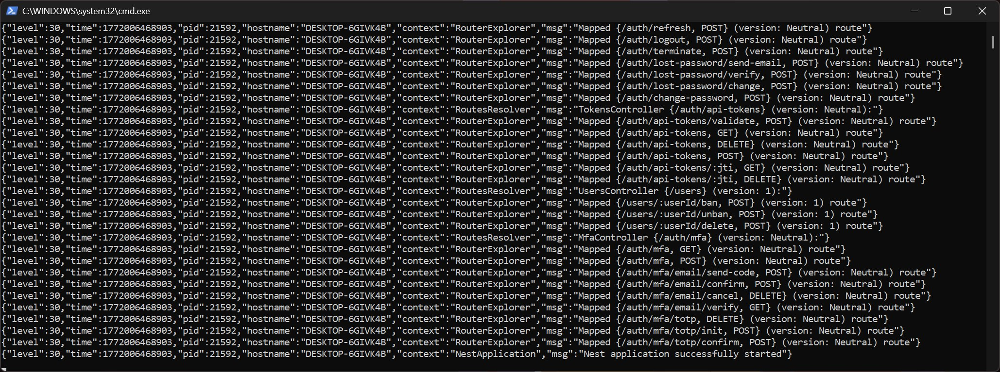
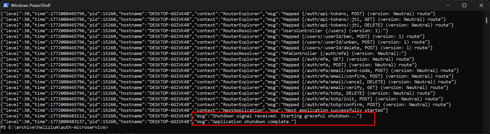

# Лабораторна робота №0: Підготовка застосунку — Readiness & Standardization

## 1. Налаштування

### Збірка однією командою (One-Command Build)

Проєкт використовує Docker для ініціалізації всього стеку (App + DB + Redis).

```bash
# Створення мережі (якщо не створена)
docker network create helizium-network

# Повний цикл збірки та запуску
docker compose up -d --build
```

Усі залежності та середовище виконання ізольовані всередині контейнерів.




### Конфігурація через середовище

Застосунок є повністю stateless і керується через змінні оточення. Усі критичні параметри (TTL токенів, порти, URL-адреси) винесені в `.env`.

Ключові змінні ([.env.example](./.env.example)):
  - DATABASE_URL: Рядок підключення до PostgreSQL.
  - REDIS_URL: Параметри підключення до Redis.
  - JWT_ACCESS_TTL / JWT_REFRESH_TTL: Налаштування життєвого циклу сесій.
  - OTLP_COLLECTOR_URL: Ендпоінт для збору метрик (OpenTelemetry).



### Автоматичне керування схемою БД
Налаштовано міграції бази даних. Приклад застосування автоматичної міграції до щойно створеної бд:


## 2. Підтвердження Health Check
### Health 200 


### Health 503 



## 3. Приклад логів
Приклад логів:


## 4. Підтвердження Shutdown
Скріншот коду обробки відповідного сигналу:


Приклад логів після надсилання відповідного сигналу:

